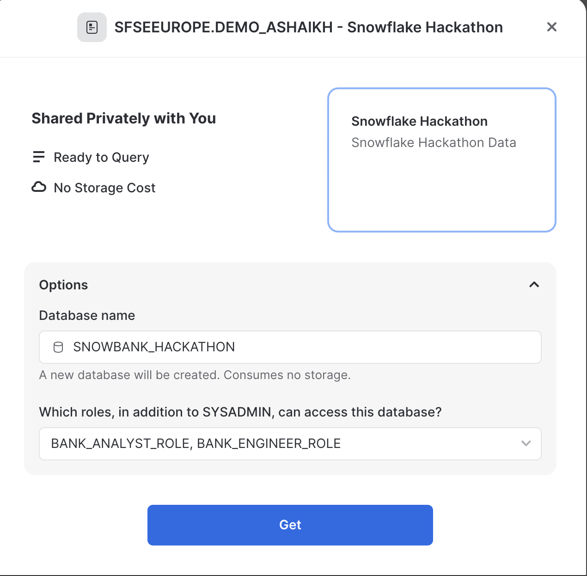

# Loading Data
Before we can do any analysis and reporting we need to bring the data into our Snowflake accounts. 

## Load Accounts Data
The first thing we are going to do is load in our accounts data. The bank has 50 Million accounts and these are all spread over multiple CSV files that are held in an external stage. Complete the following steps to load the Accounts data in:

1. Create an internal stage using your **RAW** schema pointing to **s3://snowbank-hackathon/accounts_data/**
2. Crate a CSV file format for the files. *hint: don't forget use a paramter to handle the gzip compression*
3. Create an **ACCOUNTS** table using the **ANALYTICS** Schema
```
create or replace TABLE ACCOUNTS_RAW (
	ACCOUNT_UID STRING,
	DEPOSITOR_ID STRING,
	PRODUCT_CODE INT,
    REGISTERED_PLAN_TYPE_CODE INT,
	REGISTERED_PLAN_NUMBER INT,
	CURRENCY_CODE INT,
	INSURANCE_DETERMINATION_CATEGORY_TYPE_CODE INT,
	ACCOUNT_BALANCE DECIMAL(30,2),
	ACCESSIBLE_BALANCE DECIMAL(30,2),
	CURRENT_CDIC_HOLD_AMOUNT DECIMAL(30,2),
	ACCOUNT_STATUS_CODE INT,
	CDIC_HOLD_STATUS_CODE INT,
	REGISTERED_ACCOUNT_FLAG BOOLEAN
);

```
4. Load the data into the table using Snowflake's **COPY INTO** command
5. Truncate the table and increase the warehouse size to a large and repeat the loading of data into the ACCOUNTS table. Did you notice any difference in speed?
6. **BONUS STEP** Load in some sample customer data from a json file into a table called **CUSTOMER**. Try loading it in via the UI using the [file](/Loading%20Data/customer_data.json) provided and/or try loading it progrmatically from an external stage located at: **s3://snowbank-hackathon/customer_data/**

Documentation: 
[https://docs.snowflake.com/en/user-guide/data-load-s3-copy](https://docs.snowflake.com/en/user-guide/data-load-s3-copy) Ignore using any AWS Key credentials as the bucket has been made public for simplication.

[https://docs.snowflake.com/en/user-guide/data-load-transform](https://docs.snowflake.com/en/user-guide/data-load-transform)

[Loading Semi-Structured Data Guide](https://quickstarts.snowflake.com/guide/getting_started_with_snowflake/#6)

## Bring in the rest of the Snowbank data via Snowflake Share
Everyone should have a Snowflake Hackathon data share showing up in their private sharing tab as shown below. Make sure to click **Get** and bring this data into your account. You will be using this data to join with the analytics data to create insights. You can name this database **SNOWBANK_HACKATHON** as shown below.




Now that we have brought data into the environment we can start doing some querying!