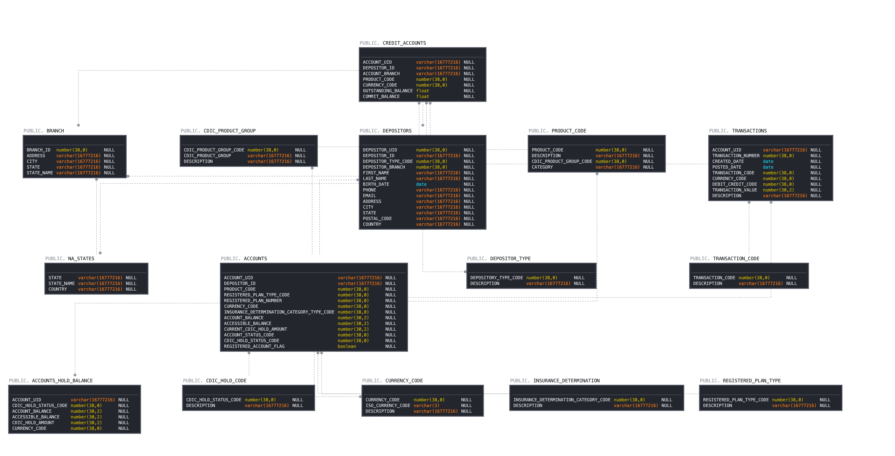

# Snowbank Hackathon

## Snowbank Overview
The Snowbank Financial Services Hackathon is built around a fictitious US & Canada bank, Snowbank which offers retail banking products to its 50M strong customer base in the US & Canada. Its business spans banking products (Chequing accounts, Saving accounts, Registered accounts) and also had a lending business to personal and commercial customers with a range of credit products (Credit Cards, Line of Credits, Mortgages).

#### The Snowbank Data model is the following:

The base data model is quite solid, and can be expanded to support additional use cases (Customer 360), but also regionalized by changing data in tables according to the scenario you want to customize it for.

## Prerequisites
Before we can begin, everyone will need to create a trial account and share their account identifier to ensure the account shares are setup. 
1. If you haven't already please [create a trial account](https://signup.snowflake.com/) with the following settings:
- **Edition:** Enterprise
- **Cloud Provider:** AWS
- **Region:** EU (Ireland)

2. Share your account identifier so that Snowflake is able to create a share of part of the Snowbank with yourself. You can locate the account identifier as follows:

**Below is a guide of hackathon scenarios for you to work through:**
  1. [Setup your account](Account%20Setup/README.md) by following the steps higlight in this setup script. This will create some roles, permissions and objects neccessary for you to use as you progress through the day. 
  2. [Loading data](Loading%20Data/README.md) This dataset contains 50 million records of bank account records spread across CSV files to be used as part of analysis and reporting.
  3. [Regulatory risk reporting](/Regulatory%20Risk%20Reporting/README.md) is a massive undertaking for the bank to ensure they are compliant with regulations. Help the bank bring together their banking and customer data and subsewuently build insights that will help the compliance teams gain oversight on CDIC requirements. 
  4. [Dynamic DevOps](/Dynamic%20DevOps/README.md) will allow you to dynamically provision, deprovision multiple environments while securing PII data in a development cycle.
  5. [COVID Credit Risk](/Covid%20Risk/README.md) is important to run a risk assessment of the Covid-19 pandemic to the bank's business and put a dollar figure estimate around the risk. We will be utilising Covid-19 data from the marketplace along with the bank's data to build up a profile of what this looks like and build a light-weight Streamlit app for quick, adhoc analysis. 
  
  The above vignettes are meant to provide structure and guidance to your hackathon experience and aim to cover a range of ways to apply the platform.. If there are other things you would like to try and experiment with in the platform, by all means please feel free to do so. Make sure you use the help of your SE if you get stuck!