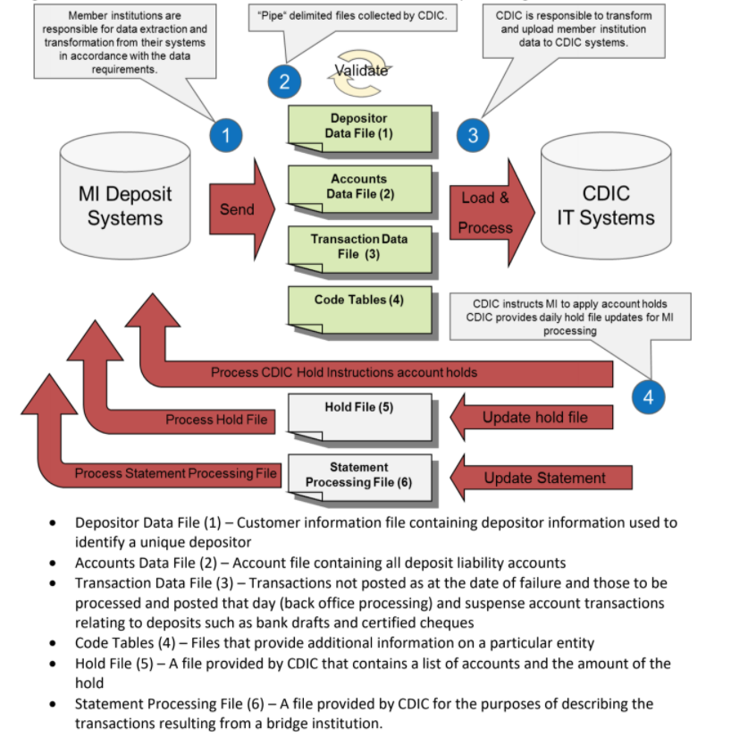
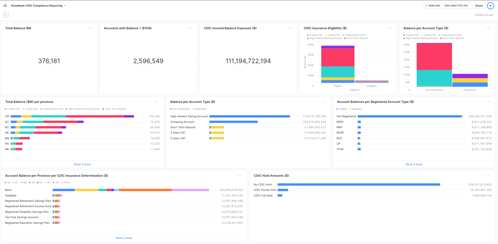

# Snowbank Regulatory Risk Reporting

## Use Case

In Canada, most banks, credit unions and other financial institutions holding customer deposits are [CDIC](https://www.cdic.ca/) member institutions. As a result, client deposits are insured up to $100k in certain types of accounts (Chequings, Savings, Registered Accounts). In order to benefit from this protection, CDIC member institutions have to provide daily data insights related to the list of depositors, accounts, transactions and other metadata to CDIC. In return, CDIC will provide them a hold file on CDIC hold balances on these accounts and a statement processing file as illustrated below.

This use case can be generalized into a compliance risk reporting use case, as the type of outputs it produces is about bank account balances across different type of banking products, and transactions made into these accounts.

## Scenario Description

In this particular demo, the scope will focus on the top part of the diagram which focuses on the data you have ingested via files and the share containing accounts, depositors, and transactions in order to produce the required compliance reporting with agility and simplicity. One particular vignette focuses on updating account balances with transactions in near-real time providing a live view to risk analysts.

The aim of this exercise will be to produce views and a dashboard answering the regulatory questions highlighted below. You can expect the output to look similar to the dashboard example below:

## Environment Settings

**Role:** SNOWBANK_ANALYST

**Warehouse:** SNOWBANK_ANALTYICS_WH

## Regulatory Questions

What is the:

1. Total balance across all accounts
2. Number of accounts with a balance less then $100K
3. CDIC Insured Balance Exposure ($) *hint: only amounts upto 100K are insured*
4. Balance by account type and insurance eligibility *hint: look at the INSURANCE_DETERMINTATION table to figure out ineligibilty code and PRODUCT_CODE table to get account type description*
5. Balance by registration (registered vs non-registered)
5. Balance by account type and registration type 
6. Total balance by Canadian province 
7. Balance per province by CDIC insurance determination type.

The idea of this exercise is to get a feel for joining data in Snowflake and creating views/charts. 

[Answers:](https://github.com/snowflakecorp/frostbytes/tree/main/Industry%20-%20Financial%20Services/Snowbank/Snowbank%20Retail%20Banking/40%20-%20analytics) Only Snowflake employees have access to this. Rely on your SE if you get stuck anywhere. 

